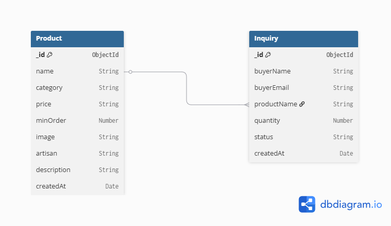

# Kumaon Craft Connect

Kumaon Craft Connect is a digital trade portal and catalog system designed to bridge the gap between rural artisans of the Kumaon Himalayan region in Uttarakhand and institutional retail buyers, boutique stores, and conscious consumers.

The platform showcases heritage handloom and handicrafts (including Panchachuli Tweed, Almora Copperware, Likhai Woodcraft, and Aipan Folk Art) and permits buyers to place wholesale inquiry sessions directly with artisan guilds, reducing reliance on intermediaries and preserving indigenous traditional craftsmanship.

---

## 📂 Folder Structure

```text
kumaon-craft-connect/
├── backend/                  # Backend Node.js service
│   ├── .gitignore            # Git exclusions for backend files
│   ├── package.json          # Node dependencies & project scripts
│   └── server.js             # Entrypoint server configuration
│
└── frontend/                 # Frontend React application (Vite + Tailwind CSS v4)
    ├── src/
    │   ├── components/       # Shared reusable UI elements
    │   │   ├── Navbar.jsx    # Glassmorphic, responsive main navigation
    │   │   ├── Footer.jsx    # Informational footer with craft categories
    │   │   └── ProductCard.jsx # Catalog item details card with wholesale inquiry dialog
    │   │
    │   ├── pages/            # Routed page views
    │   │   ├── Home.jsx      # Landing hero, metrics, search, and catalog explorer
    │   │   ├── About.jsx     # Cultural heritage, story, and four craft pillars
    │   │   ├── Login.jsx     # Minimalist login page for artisans and buyers
    │   │   └── Dashboard.jsx # Role-based portal for listing management & inquiry tracking
    │   │
    │   ├── App.jsx           # App shell and React Router path configurations
    │   ├── main.jsx          # React application root entrypoint
    │   └── index.css         # Global styles, tailwind layers, and custom typography
    │
    ├── index.html            # Core HTML template shell
    ├── vite.config.js        # Vite build configuration with Tailwind support
    └── .gitignore            # Git exclusions for React/Vite development
```

---

## ✨ Key Features Implemented

The platform has been fully developed with the following core functionalities active:

### 1. Database & Backend API Integration
- **MongoDB Atlas Integration**: Dynamic collection layers store products catalog and inquiry data securely.
- **RESTful Endpoints**: Dedicated routes process inquiries, fetch catalog items dynamically, and handle full CRUD updates.

### 2. Secure JWT & OAuth 2.0 Access
- **Token Sessions**: Registers and authenticates accounts securely with JSON Web Tokens (JWT).
- **Google OAuth Login**: Supports verified social auth flows alongside email-based roles.
- **Protected Routing**: Role-based access ensures buyers manage their own inquiries and artisans manage guild product listings.

### 3. Ask AI Concierge Chatbot
- **Gemini 3.5 Integration**: A full-screen conversational assistant provides concise guidance on Himalayan crafts.
- **Interactive Prompt Logs**: A left side panel records active session prompts and jumps to the message bubble on click.

### 4. Zero Hardcoded Data
- Every single frontend catalog view, statistic card, and metric counter dynamically reads from backend Mongoose endpoints.

---

## 📊 Database Schema Diagram

Below is the database entity-relationship schema layout representing the Products catalog and Wholesale Inquiries:



### Collections & Fields:
* **Products (`Product` model)**:
  * `_id` (ObjectId): Primary key.
  * `name` (String): Product title.
  * `category` (String): Craft type (e.g. Handloom, Copperware, Woodcraft, Aipan Art).
  * `price` (String): Wholesale pricing unit.
  * `minOrder` (Number): Minimum order quantity.
  * `image` (String): Image URL.
  * `artisan` (String): Artisan details.
  * `description` (String): Full product details.
  * `createdAt` (Date): Creation timestamp.
* **Inquiries (`Inquiry` model)**:
  * `_id` (ObjectId): Primary key.
  * `buyerName` (String): Buyer full name.
  * `buyerEmail` (String): Validated business email.
  * `productName` (String): References `Product.name`.
  * `quantity` (Number): Requested batch quantity.
  * `status` (String): Inquiry workflow status (e.g. Pending Review, Quote Sent, In Discussion).
  * `createdAt` (Date): Submission timestamp.

---

## 🛠️ How to Run Backend Locally

To run the Node.js Express backend service on your local machine:

### Prerequisites
- Node.js (v18+)
- MongoDB (Running locally or a MongoDB Atlas Cluster connection URI)

### Setup Steps
1. Navigate to the `backend` folder:
   ```bash
   cd backend
   ```
2. Install the backend dependencies:
   ```bash
   npm install
   ```
3. Configure Environment Variables:
   - Create a `.env` file inside the `backend` directory (it is already ignored by Git).
   - Copy content from `.env.example`:
     ```bash
     cp .env.example .env
     ```
   - Open `.env` and configure your `MONGO_URI` (insert your MongoDB Atlas connection string or local MongoDB connection URI) and optional `PORT`.

4. Seed the Database:
   - Populates your MongoDB collection with default products and test inquiries.
   - Run the seed script:
     ```bash
     npm run seed
     ```

5. Run the Server:
   - **For Development (hot-reloads on save):**
     ```bash
     npm run dev
     ```
   - **For Production:**
     ```bash
     npm start
     ```

The backend server will run on [http://localhost:5000](http://localhost:5000) by default. You can test the main server status by opening [http://localhost:5000/](http://localhost:5000/) in your browser.

